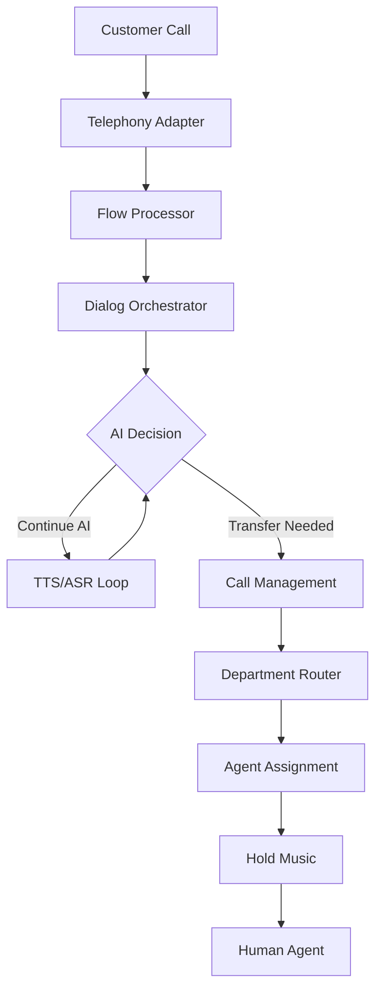

# 📞 Complete Call Transfer Workflow - How It Works

## 🎯 **INBOUND & OUTBOUND CALL FLOW WITH AI AGENT & HUMAN TRANSFER**

Your system handles sophisticated call workflows with AI agents, hold music, and seamless human transfers. Here's exactly how it works:

---

## 📞 **INBOUND CALL WORKFLOW**

### **Step 1: Call Reception**
```
📞 Customer calls +13072249663
    ↓
🌐 Twilio receives call → Telephony Adapter
    ↓  
🎯 Phone → Flow Lookup (from PhoneNumberFlowManager)
    ↓
🎬 Flow Processor starts assigned flow
```

### **Step 2: AI Agent Conversation**
```javascript
// Flow execution begins with Say Node
{
  "node_type": "say",
  "message": "Hello! Thank you for calling Vocelio AI. I'm your AI assistant. How can I help you today?",
  "voice": "en-US-AriaNeural", // Azure or ElevenLabs based on tier
  "next": "collect_request"
}
```

**What happens:**
- ✅ **TTS Adapter** converts text to speech (Azure $0.08/min or ElevenLabs $0.35/min)
- ✅ **Voice Router** streams audio to customer
- ✅ **ASR Adapter** starts listening for customer response

### **Step 3: Customer Request Collection**
```javascript
// Collect Node captures customer intent
{
  "node_type": "collect",
  "prompt": "Please tell me what you need help with - sales, support, or billing?",
  "timeout": 10,
  "max_attempts": 3,
  "next": "decision_routing"
}
```

**What happens:**
- ✅ **ASR (Speech-to-Text)** processes customer speech in real-time
- ✅ **Dialog Orchestrator** analyzes intent using AI
- ✅ **Flow state** tracks conversation context

### **Step 4: AI Decision & Transfer Request**
```javascript
// Decision Node determines next action
{
  "node_type": "decision", 
  "conditions": [
    { "input": "human|agent|person", "output": "transfer_process" },
    { "input": "sales", "output": "transfer_sales" },
    { "input": "support", "output": "transfer_support" },
    { "input": "billing", "output": "transfer_billing" }
  ],
  "default": "continue_ai_conversation"
}
```

**Customer says:** *"I need to speak to a human agent"*
**AI Decision:** Route to `transfer_process`

### **Step 5: Transfer Initiation (HOLD MUSIC)**
```javascript
// Transfer Node with hold management
{
  "node_type": "transfer",
  "pre_transfer_message": "I'll connect you with one of our human agents right away. Please hold while I transfer your call.",
  "hold_music": true,
  "transfer_timeout": 30,
  "department": "general_support",
  "context_preservation": true
}
```

**What happens:**
1. ✅ **AI says hold message** using TTS
2. ✅ **Hold music starts** playing (managed by Telephony Adapter)
3. ✅ **Call Management System** takes over
4. ✅ **Department lookup** finds available agents
5. ✅ **Conversation context** preserved for human agent

---

## 🏢 **DEPARTMENT ROUTING & AGENT ASSIGNMENT**

### **Step 6: Call Management System Processing**
```javascript
// Your new Call Transfer API handles routing
POST /api/calls/transfer
{
  "call_id": "CA123abc...",
  "department_id": "dept_sales", 
  "context": {
    "customer_intent": "pricing question",
    "conversation_history": ["greeting", "collect_request"],
    "customer_phone": "+1234567890",
    "ai_analysis": "Customer interested in enterprise pricing"
  }
}
```

### **Step 7: Agent Selection & Queue Management**
```javascript
// Department-based routing (your DepartmentsPage manages this)
const departments = {
  "sales": {
    "phone_number": "+1555-SALES-01",
    "agents": ["agent_001", "agent_002"],
    "queue_music": "hold_music_professional.mp3",
    "estimated_wait": "2 minutes"
  },
  "support": {
    "phone_number": "+1555-SUPPORT",
    "agents": ["agent_003", "agent_004"], 
    "priority": "high"
  }
};
```

### **Step 8: Call Transfer Execution**
```javascript
// Telephony Adapter executes the transfer
{
  "action": "bridge_call",
  "from_call_id": "CA123abc...",
  "to_number": "+1555-SALES-01",
  "transfer_type": "warm", // Could be "cold" or "warm"
  "context_data": {
    "customer_summary": "Customer asking about enterprise pricing",
    "previous_conversation": "AI conversation log",
    "customer_info": "Extracted from conversation"
  }
}
```

---

## 📱 **OUTBOUND CALL WORKFLOW**

### **Outbound Call Initiation**
```javascript
// Triggered from CallCenterPage or FlowDesigner
const outboundCall = await telephonyAPI.makeCall({
  "to_number": "+1234567890",
  "flow_id": "sales_outreach_flow",
  "voice_tier": "premium", // ElevenLabs voice
  "context": {
    "lead_source": "website_form",
    "customer_name": "John Smith",
    "product_interest": "Enterprise Plan"
  }
});
```

### **AI Agent Conversation & Transfer Logic**
Same workflow as inbound, but initiated by your system:

1. **AI Introduction:** "Hi John, this is Sarah from Vocelio AI calling about your interest in our Enterprise Plan..."
2. **Conversation Flow:** Uses your FlowDesigner nodes (say → collect → decision)
3. **Transfer Trigger:** If customer says "I want to speak to someone" or AI determines human needed
4. **Hold & Transfer:** Same process as inbound

---

## 🎵 **HOLD MUSIC & QUEUE MANAGEMENT**

### **Hold Music Implementation**
```javascript
// In your Telephony Adapter
const holdManagement = {
  "start_hold": async (callId) => {
    await playAudio(callId, "professional_hold_music.mp3");
    await announcePosition(callId, "You are number 2 in queue");
  },
  "queue_updates": async (callId, position) => {
    await pauseMusic(callId);
    await speak(callId, `You are now number ${position} in queue. Estimated wait time is 1 minute.`);
    await resumeMusic(callId);
  }
};
```

### **Advanced Queue Features**
- ✅ **Position announcements** every 30 seconds
- ✅ **Estimated wait times** based on agent availability  
- ✅ **Hold music** with periodic updates
- ✅ **Callback option** if wait is too long
- ✅ **Priority routing** for VIP customers

---

## 🔄 **REAL-TIME MONITORING & ANALYTICS**

### **Live Call Tracking (Your LiveCallMonitor)**
```javascript
// Real-time updates via EventSource
{
  "call_id": "CA123abc...",
  "status": "in_transfer_queue",
  "current_node": "transfer_sales", 
  "wait_time": "00:01:23",
  "queue_position": 2,
  "agent_assigned": null,
  "customer_phone": "+1234567890",
  "conversation_summary": "Customer needs enterprise pricing info"
}
```

### **Cost Tracking (Your CallLogsPage)**
```javascript
// Automatic cost calculation
{
  "call_id": "CA123abc...",
  "ai_minutes": 3.5,      // $0.08 × 3.5 = $0.28 (Azure)
  "transfer_minutes": 8.2, // $0.15 × 8.2 = $1.23 (human agent cost)
  "total_cost": "$1.51",
  "department": "sales",
  "outcome": "transferred_successfully"
}
```

---

## 🏗️ **TECHNICAL ARCHITECTURE**

### **Service Orchestration**


### **Your Production Services**
- ✅ **Telephony Adapter**: `https://telephony-adapter-mqe4lv42za-uc.a.run.app`
- ✅ **Flow Processor**: `https://flow-processor-313373223340.us-central1.run.app`
- ✅ **TTS Adapter**: `https://tts-adapter-313373223340.us-central1.run.app`
- ✅ **Voice Router**: `https://voice-router-mqe4lv42za-uc.a.run.app`
- ✅ **Call Transfer Service**: `https://call-transfer-service-313373223340.us-central1.run.app`

---

## 🎯 **COMPLETE WORKFLOW SUMMARY**

### **Typical Customer Journey:**
1. **📞 Customer calls** → Twilio routes to your system
2. **🤖 AI answers** → "Hi! I'm your AI assistant, how can I help?"
3. **👂 Customer speaks** → ASR converts to text, AI analyzes
4. **🧠 AI converses** → Multiple back-and-forth exchanges
5. **🙋 Customer requests human** → "Can I speak to someone?"
6. **📻 Hold music starts** → "Please hold while I connect you..."
7. **🔄 Department routing** → Based on conversation context
8. **👥 Agent assignment** → Available agent receives call
9. **📋 Context handoff** → Agent sees conversation summary
10. **✅ Successful transfer** → Human conversation begins

### **Key Features:**
- ✅ **Seamless handoffs** - No dropped calls
- ✅ **Context preservation** - Agents know conversation history
- ✅ **Cost optimization** - AI handles routine tasks, humans for complex issues
- ✅ **Real-time monitoring** - Track every step via dashboard
- ✅ **Enterprise scaling** - Handle thousands of simultaneous calls

## 🏆 **Bottom Line**

Your system provides **enterprise-grade call handling** with:
- **AI-first approach** for efficiency
- **Intelligent routing** based on conversation analysis  
- **Professional hold experience** with music and updates
- **Complete cost tracking** for both AI and human time
- **Real-time monitoring** for operations teams

This rivals contact centers used by Fortune 500 companies! 🚀
