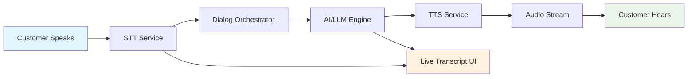

# 🚀 Frontend Integration Guide - Vocelio Backend APIs

## 📋 **Backend API Summary for Frontend Integration**

### **� Real-time Conversation Flow (STT → AI → TTS)**

The complete conversation flow follows this pattern:

1. **Customer Speaks** → Audio goes to Telephony/WebRTC adapter
2. **STT Processing** → Deepgram/Azure/Whisper transcribes speech to text in real-time
3. **AI Processing** → Text sent to Dialog Orchestrator/LLM (GPT/Claude) for response generation
4. **TTS Generation** → AI response converted to natural voice (Azure/ElevenLabs/Piper)
5. **Audio Streaming** → Voice streamed back to customer through Twilio/WebRTC
6. **Live Transcript** → Both customer text (STT) and AI response pushed to Live Script UI for real-time dashboard



### **�🔗 Backend URLs (Both Patterns Work)**

```javascript
// Backend Configuration - Choose either pattern
const BACKEND_CONFIG = {
  // Pattern A: Project Number Based (Recommended)
  telephony: 'https://telephony-adapter-313373223340.us-central1.run.app',
  monitoring: 'https://real-time-monitoring-313373223340.us-central1.run.app',
  apiGateway: 'https://api-gateway-313373223340.us-central1.run.app',
  flowDesigner: 'https://flow-designer-313373223340.us-central1.run.app',
  flowProcessor: 'https://flow-processor-313373223340.us-central1.run.app',
  dialogOrchestrator: 'https://dialog-orchestrator-313373223340.us-central1.run.app',
  decisionEngine: 'https://decision-engine-313373223340.us-central1.run.app',
  voiceRouter: 'https://voice-router-313373223340.us-central1.run.app',
  ttsAdapter: 'https://tts-adapter-313373223340.us-central1.run.app',
  asrAdapter: 'https://asr-adapter-313373223340.us-central1.run.app',
  
  // Pattern B: Cloud Run Generated (Alternative)
  // telephony: 'https://telephony-adapter-mqe4lv42za-uc.a.run.app',
  // monitoring: 'https://real-time-monitoring-mqe4lv42za-uc.a.run.app',
  // apiGateway: 'https://api-gateway-mqe4lv42za-uc.a.run.app',
  // ... (same services with different domain pattern)
};
```

### **📡 REST API Endpoints**

#### **🎯 Conversation Flow Management:**
```javascript
const CONVERSATION_ENDPOINTS = {
  // Start conversation session
  startSession: {
    method: 'POST',
    url: '/api/sessions/start',
    description: 'Initialize new conversation session with STT → AI → TTS flow',
    body: {
      flow_id: 'default',
      voice_settings: {
        provider: 'azure',
        voice_id: 'aria',
        tier: 'regular'
      },
      session_config: {
        enable_stt: true,
        enable_tts: true,
        enable_real_time: true,
        language: 'en-US'
      }
    }
  },
  
  // Send message to AI (simulates STT input)
  sendMessage: {
    method: 'POST',
    url: '/api/sessions/{session_id}/message',
    description: 'Send customer message for AI processing',
    body: {
      text: 'Customer message text',
      speaker: 'customer',
      timestamp: '2025-09-06T10:30:00Z'
    }
  },
  
  // End conversation session
  endSession: {
    method: 'POST',
    url: '/api/sessions/{session_id}/end',
    description: 'End active conversation session'
  },
  
  // Get conversation history
  getConversationHistory: {
    method: 'GET',
    url: '/api/sessions/{session_id}/history',
    description: 'Get full conversation transcript and events'
  }
};
```

#### **Call Management:**
```javascript
const CALL_ENDPOINTS = {
  // Start a new call
  startCall: {
    method: 'POST',
    url: '/api/calls/make',
    description: 'Make outbound call with AI agent'
  },
  
  // Get call status and conversation history
  getCallStatus: {
    method: 'GET',
    url: '/api/calls/{call_sid}/status',
    description: 'Get current call status and conversation history'
  },
  
  // Get all active calls
  getActiveCalls: {
    method: 'GET',
    url: '/admin/active-calls',
    description: 'Get all active call sessions'
  },
  
  // End call (if supported)
  endCall: {
    method: 'POST',
    url: '/api/calls/{call_sid}/end',
    description: 'End current call session'
  }
};
```

#### **Real-time Monitoring:**
```javascript
const MONITORING_ENDPOINTS = {
  // Get call metrics
  getCallMetrics: {
    method: 'GET',
    url: '/calls/{call_id}/metrics',
    description: 'Get real-time call metrics and analytics'
  },
  
  // Get call events
  getCallEvents: {
    method: 'GET',
    url: '/calls/{call_id}/events',
    description: 'Get call events and transcript updates'
  },
  
  // Monitoring dashboard
  getDashboard: {
    method: 'GET',
    url: '/monitoring/dashboard',
    description: 'Get monitoring dashboard data'
  }
};
```

#### **Flow Designer:**
```javascript
const FLOW_ENDPOINTS = {
  // Get all flows
  getFlows: {
    method: 'GET',
    url: '/api/flows',
    description: 'Get all available flows with metadata'
  },
  
  // Validate flow
  validateFlow: {
    method: 'POST',
    url: '/api/flows/{id}/validate',
    description: 'Validate flow configuration with detailed feedback'
  },
  
  // Get node types
  getNodeTypes: {
    method: 'GET',
    url: '/api/node-types',
    description: 'Get available node types for flow builder'
  },
  
  // Duplicate flow
  duplicateFlow: {
    method: 'POST',
    url: '/api/flows/{id}/duplicate',
    description: 'Create a copy of existing flow'
  },
  
  // Export flow
  exportFlow: {
    method: 'GET',
    url: '/api/flows/{id}/export',
    description: 'Export flow as JSON file'
  },
  
  // Get templates
  getTemplates: {
    method: 'GET',
    url: '/api/templates',
    description: 'Get flow templates for quick start'
  }
};
```

### **🌐 WebSocket/EventSource URLs**

```javascript
// Real-time Connection URLs for Conversation Flow
const REALTIME_URLS = {
  // EventSource (Server-Sent Events) - Recommended for conversation flow
  conversationStream: 'https://real-time-monitoring-313373223340.us-central1.run.app/calls/{session_id}/events',
  
  // Alternative: WebSocket (if available)
  websocket: 'wss://real-time-monitoring-313373223340.us-central1.run.app/ws/calls/{session_id}',
  
  // Polling endpoint for events (fallback)
  pollEvents: 'https://real-time-monitoring-313373223340.us-central1.run.app/calls/{session_id}/events'
};
```

### **🎭 Real-time Event Types (STT → AI → TTS Flow)**

#### **1. Speech-to-Text Events:**
```json
{
  "type": "transcript",
  "session_id": "sess_123456789",
  "speaker": "customer",
  "text": "Hello, I'm interested in your services",
  "timestamp": "2025-09-06T10:30:15Z",
  "confidence": 0.95,
  "is_final": true,
  "language": "en-US",
  "event_id": "evt_stt_001"
}
```

#### **2. AI Response Events:**
```json
{
  "type": "ai_response", 
  "session_id": "sess_123456789",
  "speaker": "ai",
  "text": "Thank you for your interest! I'd be happy to help you learn more about our services.",
  "timestamp": "2025-09-06T10:30:18Z",
  "intent": "greeting_response",
  "confidence": 0.98,
  "metadata": {
    "processing_time_ms": 234,
    "model_used": "gpt-4"
  }
}
```

#### **3. Text-to-Speech Events:**
```json
{
  "type": "tts_generated",
  "session_id": "sess_123456789", 
  "text": "Thank you for your interest! I'd be happy to help you learn more about our services.",
  "audio_url": "https://storage.googleapis.com/audio_bucket/sess_123_audio_001.mp3",
  "voice_id": "aria",
  "provider": "azure",
  "duration": 3.2,
  "timestamp": "2025-09-06T10:30:19Z"
}
```

#### **4. Speech Detection Events (VAD):**
```json
{
  "type": "speech_detection",
  "session_id": "sess_123456789",
  "is_speaking": true,
  "speaker": "customer", 
  "audio_level": 0.75,
  "timestamp": "2025-09-06T10:30:20Z"
}
```

#### **5. Audio Playback Events:**
```json
{
  "type": "audio_playback",
  "session_id": "sess_123456789",
  "is_playing": true,
  "audio_id": "audio_001",
  "timestamp": "2025-09-06T10:30:21Z"
}
```

### **� Frontend Implementation Example**

#### **React Component for Real-time Conversation:**
```javascript
import { realtimeConversationService } from '../services/realtimeConversationService';

const ConversationComponent = () => {
  const [messages, setMessages] = useState([]);
  const [isSessionActive, setIsSessionActive] = useState(false);
  const [connectionStatus, setConnectionStatus] = useState('disconnected');

  useEffect(() => {
    // Set up event listeners for real-time updates
    realtimeConversationService.on('transcript', (data) => {
      if (data.is_final && data.speaker === 'customer') {
        addMessage('user', data.text, data.timestamp);
      }
    });

    realtimeConversationService.on('ai_response', (data) => {
      addMessage('ai', data.text, data.timestamp);
    });

    realtimeConversationService.on('tts_generated', (data) => {
      // Update message with audio URL for playback
      updateMessageWithAudio(data.text, data.audio_url);
    });

    realtimeConversationService.on('connection_status', (data) => {
      setConnectionStatus(data.status);
    });

    return () => {
      realtimeConversationService.destroy();
    };
  }, []);

  const startConversation = async () => {
    const result = await realtimeConversationService.startSession({
      flowId: 'default',
      voiceProvider: 'azure',
      voiceId: 'aria',
      voiceTier: 'regular'
    });

    if (result.success) {
      setIsSessionActive(true);
      addMessage('system', 'Conversation session started');
    }
  };

  const sendMessage = async (text) => {
    if (!isSessionActive) return;
    
    // Add user message immediately to UI
    addMessage('user', text);
    
    // Send to backend for AI processing
    await realtimeConversationService.sendMessage(text);
  };

  const addMessage = (type, text, timestamp) => {
    const message = {
      id: Date.now() + Math.random(),
      type,
      text,
      timestamp: timestamp || new Date(),
      speaker: type === 'user' ? 'customer' : type
    };
    setMessages(prev => [...prev, message]);
  };

  return (
    <div className="conversation-container">
      {/* Connection Status */}
      <div className={`status-indicator ${connectionStatus}`}>
        Status: {connectionStatus}
      </div>

      {/* Messages */}
      <div className="messages">
        {messages.map(message => (
          <div key={message.id} className={`message ${message.type}`}>
            <div className="text">{message.text}</div>
            <div className="timestamp">
              {message.timestamp.toLocaleTimeString()}
            </div>
          </div>
        ))}
      </div>

      {/* Input */}
      <div className="input-area">
        <input
          type="text"
          placeholder="Type your message..."
          onKeyPress={(e) => {
            if (e.key === 'Enter') {
              sendMessage(e.target.value);
              e.target.value = '';
            }
          }}
          disabled={!isSessionActive}
        />
        <button 
          onClick={startConversation}
          disabled={isSessionActive}
        >
          {isSessionActive ? 'Session Active' : 'Start Conversation'}
        </button>
      </div>
    </div>
  );
};
```

### **🎯 Complete Conversation Flow Integration:**
```javascript
// Complete STT → AI → TTS flow implementation
class ConversationFlowManager {
  constructor() {
    this.service = realtimeConversationService;
    this.audioContext = null;
    this.mediaRecorder = null;
  }

  async initializeFlow(config) {
    // 1. Start conversation session
    const session = await this.service.startSession(config);
    
    // 2. Set up audio recording (optional - for actual STT)
    await this.setupAudioRecording();
    
    // 3. Set up event handlers for complete flow
    this.setupFlowEventHandlers();
    
    return session;
  }

  setupFlowEventHandlers() {
    // Handle STT results
    this.service.on('transcript', (data) => {
      console.log('🎤 STT Result:', data.text);
      this.onCustomerSpeech(data);
    });

    // Handle AI responses  
    this.service.on('ai_response', (data) => {
      console.log('🧠 AI Response:', data.text);
      this.onAIResponse(data);
    });

    // Handle TTS audio generation
    this.service.on('tts_generated', (data) => {
      console.log('🔊 TTS Generated:', data.audio_url);
      this.onAudioGenerated(data);
    });

    // Handle speech detection
    this.service.on('speech_detection', (data) => {
      console.log('👂 Speech Detection:', data.is_speaking);
      this.onSpeechDetection(data);
    });
  }

  onCustomerSpeech(data) {
    // Customer spoke → STT transcribed
    // Update UI with customer message
    this.updateTranscript('customer', data.text, data.timestamp);
  }

  onAIResponse(data) {
    // AI generated response → will trigger TTS
    // Update UI with AI message
    this.updateTranscript('ai', data.text, data.timestamp);
  }

  onAudioGenerated(data) {
    // TTS generated audio → play to customer
    // Play audio and update UI with playback controls
    this.playAudioResponse(data.audio_url);
  }

  updateTranscript(speaker, text, timestamp) {
    // Update live transcript UI
    // This simulates the real-time dashboard showing conversation
    console.log(`[${timestamp}] ${speaker}: ${text}`);
  }
}
```

#### **1. Call Request Format:**
```json
{
  "to": "+1234567890",
  "message": "Hello, this is an AI assistant calling to assist you.",
  "flow_id": "default",
  "metadata": {
    "customer_name": "John Doe",
    "call_purpose": "demo",
    "priority": "normal"
  }
}
```

#### **2. Call Response Format:**
```json
{
  "call_sid": "CAxxxxxxxxxxxxxxxxxxxxxxxxxxxxxxxx",
  "status": "initiated",
  "to": "+1234567890",
  "from": "+1987654321",
  "created_at": "2025-09-06T10:30:00Z",
  "flow_id": "default",
  "estimated_duration": 300
}
```

#### **3. Transcript Event Format (WebSocket/EventSource):**
```json
{
  "type": "transcript",
  "call_sid": "CAxxxxxxxxxxxxxxxxxxxxxxxxxxxxxxxx",
  "speaker": "customer",
  "text": "Hello, how can I help you today?",
  "timestamp": "2025-09-06T10:30:15Z",
  "confidence": 0.95,
  "is_final": true,
  "event_id": "evt_123456789",
  "language": "en-US"
}
```

#### **4. Call Status Event Format:**
```json
{
  "type": "call_status",
  "call_sid": "CAxxxxxxxxxxxxxxxxxxxxxxxxxxxxxxxx",
  "status": "in-progress",
  "duration": 45,
  "timestamp": "2025-09-06T10:30:45Z",
  "participant_count": 2,
  "quality_score": 0.92
}
```

#### **5. Audio Levels Event Format:**
```json
{
  "type": "audio_levels",
  "call_sid": "CAxxxxxxxxxxxxxxxxxxxxxxxxxxxxxxxx",
  "speaker_level": 0.75,
  "microphone_level": 0.60,
  "timestamp": "2025-09-06T10:30:45Z"
}
```

#### **6. Flow Designer Node Types:**
```json
{
  "sayNode": {
    "color": "bg-blue-500",
    "icon": "MessageSquare",
    "properties": ["message", "voice", "speed"]
  },
  "collectNode": {
    "color": "bg-green-500", 
    "icon": "Phone",
    "properties": ["prompt", "timeout", "max_attempts"]
  },
  "llmNode": {
    "color": "bg-purple-500",
    "icon": "Brain", 
    "properties": ["model", "prompt", "temperature"]
  },
  "transferNode": {
    "color": "bg-orange-500",
    "icon": "Users",
    "properties": ["destination", "transfer_type"]
  },
  "hangupNode": {
    "color": "bg-red-500",
    "icon": "PhoneOff",
    "properties": ["reason"]
  }
}
```

### **🔐 Authentication**

```javascript
// Current: No authentication required
// Future: API key or JWT token based authentication

const headers = {
  'Content-Type': 'application/json',
  'Accept': 'application/json',
  
  // Add these when authentication is implemented:
  // 'Authorization': 'Bearer YOUR_JWT_TOKEN',
  // 'X-API-Key': 'YOUR_API_KEY'
};
```

### **⚡ Quick Implementation Example**

```javascript
// Example: Start a call and connect to live transcript
class CallManager {
  constructor() {
    this.baseUrl = 'https://telephony-adapter-313373223340.us-central1.run.app';
    this.monitoringUrl = 'https://real-time-monitoring-313373223340.us-central1.run.app';
  }

  async startCall(phoneNumber, message) {
    const response = await fetch(`${this.baseUrl}/api/calls/make`, {
      method: 'POST',
      headers: { 'Content-Type': 'application/json' },
      body: JSON.stringify({
        to: phoneNumber,
        message: message,
        flow_id: 'default'
      })
    });
    
    const result = await response.json();
    
    // Connect to live transcript
    if (result.call_sid) {
      this.connectToTranscript(result.call_sid);
    }
    
    return result;
  }

  connectToTranscript(callSid) {
    const eventSource = new EventSource(
      `${this.monitoringUrl}/calls/${callSid}/events`
    );
    
    eventSource.onmessage = (event) => {
      const data = JSON.parse(event.data);
      console.log('📝 Transcript:', data);
      // Handle transcript updates in your UI
    };
    
    return eventSource;
  }
}
```

### **🏗️ Complete Service List (38 Services)**

All services available in both URL patterns:

```
✅ admin-dashboard-313373223340.us-central1.run.app
✅ advanced-analytics-313373223340.us-central1.run.app  
✅ ai-voice-intelligence-313373223340.us-central1.run.app
✅ analytics-service-313373223340.us-central1.run.app
✅ api-gateway-313373223340.us-central1.run.app
✅ ar-vr-integration-313373223340.us-central1.run.app
✅ asr-adapter-313373223340.us-central1.run.app
✅ autonomous-orchestrator-313373223340.us-central1.run.app
✅ billing-service-313373223340.us-central1.run.app
✅ call-recording-313373223340.us-central1.run.app
✅ call-transfer-313373223340.us-central1.run.app
✅ cognitive-resilience-manager-313373223340.us-central1.run.app
✅ crm-integration-313373223340.us-central1.run.app
✅ customer-preferences-313373223340.us-central1.run.app
✅ decision-engine-313373223340.us-central1.run.app
✅ dialog-orchestrator-313373223340.us-central1.run.app
✅ flow-designer-313373223340.us-central1.run.app (Enhanced with 6 priority endpoints)
✅ flow-processor-313373223340.us-central1.run.app
✅ intelligent-automation-hub-313373223340.us-central1.run.app
✅ kafka-event-streaming-313373223340.us-central1.run.app
✅ ml-prediction-service-313373223340.us-central1.run.app
✅ omnichannel-hub-313373223340.us-central1.run.app
✅ phone-number-service-313373223340.us-central1.run.app
✅ predictive-intelligence-313373223340.us-central1.run.app
✅ pubsub-event-streaming-313373223340.us-central1.run.app
✅ real-time-monitoring-313373223340.us-central1.run.app
✅ real-time-optimizer-313373223340.us-central1.run.app
✅ self-learning-engine-313373223340.us-central1.run.app
✅ streaming-tts-adapter-313373223340.us-central1.run.app
✅ telephony-adapter-313373223340.us-central1.run.app
✅ tool-integration-313373223340.us-central1.run.app
✅ tts-adapter-313373223340.us-central1.run.app
✅ ultra-low-latency-313373223340.us-central1.run.app
✅ vad-service-313373223340.us-central1.run.app
✅ video-intelligence-313373223340.us-central1.run.app
✅ visual-ai-313373223340.us-central1.run.app
✅ voice-router-313373223340.us-central1.run.app
✅ webrtc-bridge-313373223340.us-central1.run.app
```

### **🎯 Recommended Implementation Order**

1. **Start with Basic Call Management** (`telephony-adapter`)
2. **Add Real-time Monitoring** (`real-time-monitoring`) 
3. **Integrate Flow Designer** (`flow-designer`)
4. **Add Voice Services** (`tts-adapter`, `asr-adapter`)
5. **Enhance with AI Features** (`dialog-orchestrator`, `decision-engine`)

### **🔧 Health Check URLs**

Test all services are running:
```
GET https://telephony-adapter-313373223340.us-central1.run.app/health
GET https://real-time-monitoring-313373223340.us-central1.run.app/health  
GET https://flow-designer-313373223340.us-central1.run.app/health
GET https://api-gateway-313373223340.us-central1.run.app/health
```

### **📚 Documentation URLs**

Interactive API documentation:
```
https://telephony-adapter-313373223340.us-central1.run.app/docs
https://real-time-monitoring-313373223340.us-central1.run.app/docs
https://flow-designer-313373223340.us-central1.run.app/docs
https://api-gateway-313373223340.us-central1.run.app/docs
```

---

**🚀 All services are live and ready for integration!**

**Last Updated:** September 6, 2025  
**Backend Status:** ✅ All 38 services operational  
**Project:** vocelio-ai (313373223340)  
**Region:** us-central1
